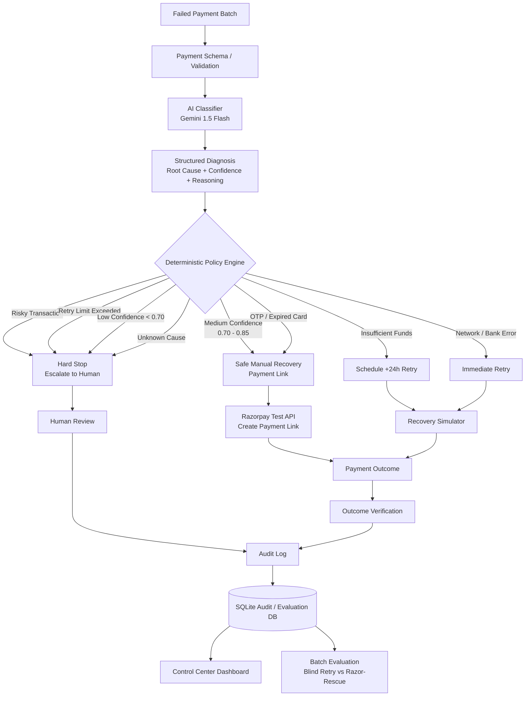

# Razor-Rescue Architecture

## System Design
Razor-Rescue explicitly separates **probabilistic diagnosis** (AI) from **deterministic action** (Code). This ensures that the agent operates entirely within strict, auditable financial guardrails.

## Build Challenges & Technical Obstacles

During the development of this project, we encountered two significant engineering challenges that forced us to redesign our evaluation and execution models.

### 1. What broke: Guardrail Precedence
During testing, we discovered that a medium-confidence risky transaction could reach the generic payment-link branch before the risky-transaction safety rule. 
For example, a `risky_card` failure with `confidence = 0.80` could previously result in `send_payment_link` instead of the expected `escalate_to_human`.

**How we recovered:**
We changed the policy evaluation order so that **hard safety stops execute before confidence-based routing**:
1. Risk check
2. Retry-limit check
3. Confidence check
4. Business action

We then added explicit Pytest regression tests covering combinations like "risky transaction + medium confidence" and "retry limit exceeded + high confidence" to permanently ensure the LLM can never override a hard safety stop.

### 2. What broke: Recovery Measurement
Initially, payment-link creation was treated as a recovery action but wasn't counted as recovered revenue. That was correct financially — creating a link does not mean the customer actually paid — but it meant our evaluation benchmark showed `₹0` recovered for those branches.

**How we recovered:**
We implemented a simulated downstream outcome.
`Payment failed` ➡️ `Payment Link created` ➡️ `Customer conversion simulated (40% probability)` ➡️ `Payment successful` ➡️ `₹ recovered`

Our evaluation simulator now mathematically supports payment-link conversion and delayed-retry outcomes based on realistic statistical probabilities, allowing us to honestly measure `₹ recovered` across a batch without artificially inflating numbers.
