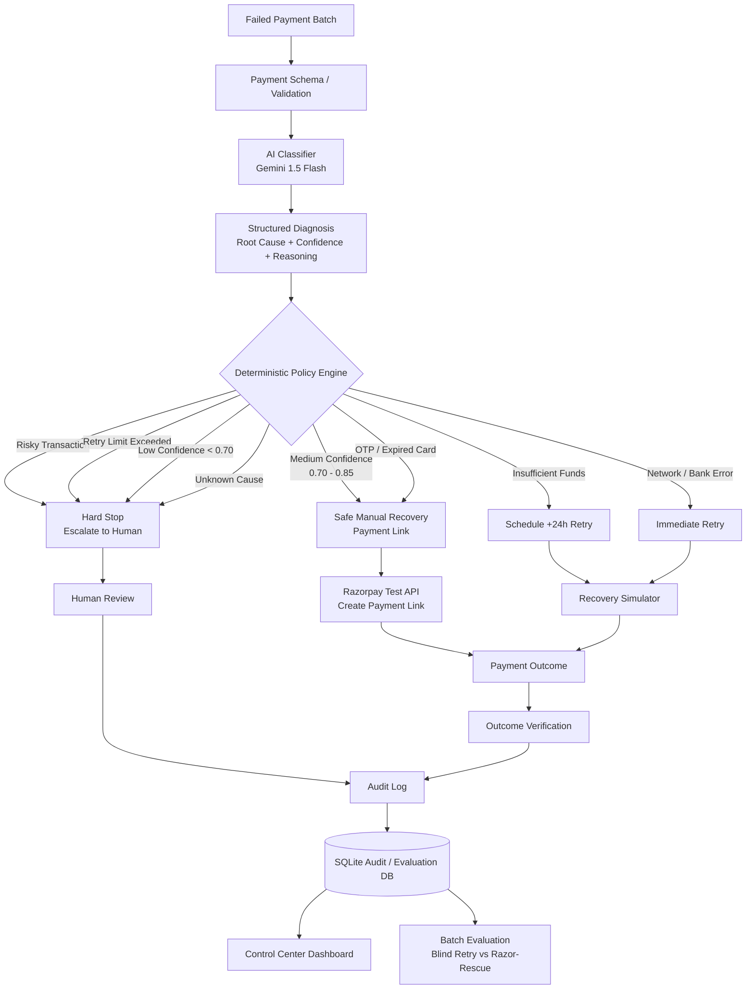

# Razor-Rescue: AI Revenue Recovery Agent
*Submission for Razorpay AI Buildathon (Track 3)*

An intelligent, bounded agent that detects failed payments, diagnoses the root cause, and executes a strictly gated recovery action to save revenue without triggering unsafe retries.

## The Problem
Blindly retrying failed payments is dangerous. If you immediately retry an expired card, an OTP failure, or a risky transaction, you will fail again, incur bank penalties, and damage customer trust.

## The Solution
Razor-Rescue acts as a highly intelligent router. It reads the messy error logs of a failed payment, uses an AI model to diagnose the true root cause, and then applies hard-coded Python safety guardrails before deciding to execute a Razorpay action (like sending a payment link, waiting 24 hours, or retrying immediately).

## Evaluation Methodology & Running the Project

This repository contains two distinct execution workflows depending on whether you are running a batch simulation evaluation or hitting the live Razorpay Test APIs.

### 1. The Evaluation Harness (Simulation & Benchmarking)
Proves the mathematical ROI of the agent against a "Blind Retry" baseline.
```bash
python evaluate.py --records 5000 --fast
streamlit run dashboard.py
```
**Methodology:**
- **Dataset:** Synthetic failed payments generated internally.
- **Seed:** 42 (Deterministic for reproducible testing)
- **Baseline:** Strategy A (Blind immediate retry for all failures)
- **Agent:** Strategy B (Razor-Rescue AI diagnosis + Guardrail engine)
- **Outcome model:** Cause-specific recovery simulator (e.g. 40% conversion on links)
- **Metrics Evaluated:** Recovery rate, INR recovered, Unsafe retries avoided, Human escalation volume.

### 2. The Execution Engine (Razorpay Test APIs)
Runs the agent in an execution loop that actually triggers the Razorpay Python SDK to generate Payment Links.
```bash
python run.py
```

## Architecture

See the full architecture diagram and design explanation:
👉 [Architecture & Recovery Design](ARCHITECTURE.md)

Razor-Rescue explicitly separates **probabilistic diagnosis** (AI) from **deterministic action** (Code). This ensures that the agent operates entirely within strict, auditable financial guardrails.



### 1. Classifier Agent (AI)
Uses Gemini 1.5 Flash to parse the messy error descriptions and metadata. It outputs a strictly typed JSON containing the `root_cause`, a `confidence_score`, and its `reasoning`.

### 2. Decision Engine (Deterministic Code)
The LLM **never** decides to move money directly. It only classifies. The Decision Engine takes the classification and applies hardcoded business rules (e.g., "Max 3 retries", "Never retry a card flagged for risk"). This proves bounded action and explainability.

### 3. Execution Layer
Connects to Razorpay Test APIs to generate a new Payment Link when the user needs to re-authenticate (OTP failure) or use a different payment method (Card Expired).

### 4. Audit & Metrics (Structured Logging)
Every single step (Input -> LLM Thought -> Guardrail Decision -> API Outcome) is logged into an SQLite database (`audit.db` or `evaluation.db`). This guarantees total explainability and allows us to generate honest, measured metrics (Recovery Rate and INR Amount Recovered). 

## Build Challenges & Technical Obstacles

### 1. What broke: Guardrail Precedence
During testing, we discovered that a medium-confidence risky transaction could reach the generic payment-link branch before the risky-transaction safety rule. 
**How we recovered:** We changed the policy evaluation order so that **hard safety stops execute before confidence-based routing** (Risk check -> Retry-limit -> Confidence -> Business action). We then added Pytest regression tests to permanently ensure the LLM can never override a hard safety stop.

### 2. What broke: Recovery Measurement
Initially, payment-link creation was treated as a recovery action but wasn't counted as recovered revenue. That was correct financially, but meant our evaluation benchmark showed `₹0` recovered for those branches.
**How we recovered:** We implemented a simulated downstream outcome (`Payment Link created` ➡️ `Customer conversion simulated` ➡️ `Payment successful` ➡️ `₹ recovered`). Our evaluation simulator now mathematically supports link conversion based on realistic statistical probabilities, allowing us to honestly measure `₹ recovered` across a batch. 

## How to Set Up

1. Clone the repo and install dependencies:
```bash
pip install -r requirements.txt
```

2. Add your `.env` variables (use `.env.example` as a template):
```env
RAZORPAY_KEY_ID=rzp_test_...
RAZORPAY_KEY_SECRET=...
GEMINI_API_KEY=...
```

## Running Tests
To prove the guardrails work deterministically, you can run the unit tests:
```bash
pip install pytest
pytest tests/
```
