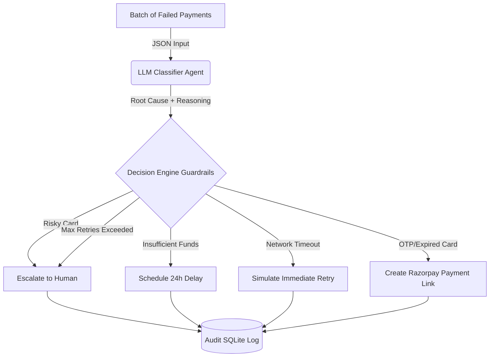

# Razor-Rescue: AI Revenue Recovery Agent

This project was built for the **Razorpay AI Buildathon** under **Track 3: AI Revenue Recovery**.

## Problem Statement
Payments fail for many recoverable reasons (bank timeouts, incorrect OTPs, expired cards), but merchants often retry blindly or not at all. This results in wasted money on hopeless retries (like fraud) and lost money on recoverable ones. 

## The Solution
Razor-Rescue is an AI-powered agentic workflow that ingests batches of failed payments, uses an LLM to accurately diagnose the root cause, and passes the classification to a strict, deterministic rule engine that executes the most appropriate and compliant recovery action.

## Architecture



### 1. Classifier Agent (AI)
Uses Gemini 1.5 Flash to parse the messy error descriptions and metadata. It outputs a strictly typed JSON containing the `root_cause`, a `confidence_score`, and its `reasoning`.

### 2. Decision Engine (Deterministic Code)
The LLM **never** decides to move money directly. It only classifies. The Decision Engine takes the classification and applies hardcoded business rules (e.g., "Max 3 retries", "Never retry a card flagged for risk"). This proves bounded action and explainability.

### 3. Execution Layer
Connects to Razorpay Test APIs to generate a new Payment Link when the user needs to re-authenticate (OTP failure) or use a different payment method (Card Expired).

### 4. Audit & Metrics (Structured Logging)
Every single step (Input -> LLM Thought -> Guardrail Decision -> API Outcome) is logged into an SQLite database (`audit.db`). This guarantees total explainability and allows us to generate honest, measured metrics (Recovery Rate and INR Amount Recovered). In a production deployment, this SQLite logger would be replaced with a structured logging pipeline (e.g., ELK stack).

## How to Run

1. Clone the repo and install dependencies:
```bash
pip install -r requirements.txt
```

2. Add your `.env` variables (use `.env.example` as a template):
```env
RAZORPAY_KEY_ID=rzp_test_...
RAZORPAY_KEY_SECRET=...
GEMINI_API_KEY=...
```

3. Run the backend batch process:
```bash
python run.py
```

4. **Launch the Audit Dashboard (UI)**:
After `audit.db` is generated, run the Streamlit dashboard to visually audit the LLM decisions vs Guardrails:
```bash
streamlit run dashboard.py
```

## Running Tests
To prove the guardrails work deterministically, you can run the unit tests:
```bash
pip install pytest
pytest tests/
```
